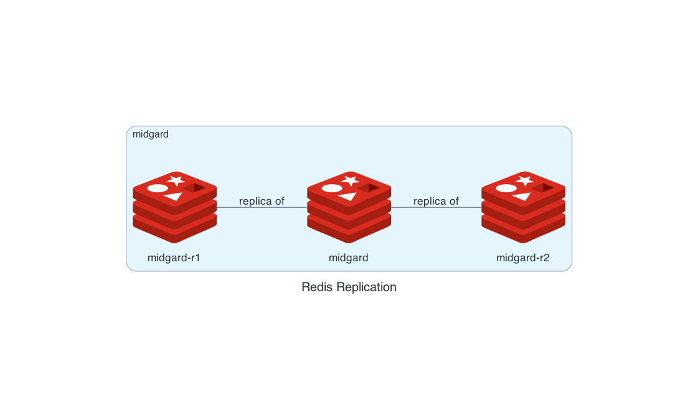

# Redis Replication

[](./diagram.png)

## Run All Redis

```shell
docker compose up
```

## Stop All Redis

```shell
docker compose down
```

## Connect to Midgard via Biforst

```shell
docker exec -it bifrost redis-cli -h midgard info replication # you will see midgard-r1 and midgard-2 IPs
```

## Simulate Midgard's Fall

### Stopping Midgard

```shell
docker compose stop midgard
# now midgard-r1 and midgard-r2 can't work properly
```

### Set Midgard-r2 to be Midgard-r1's replica

```shell
docker exec -it bifrost redis-cli -h midgard-r2 slaveof midgard-r1 6379
```


### Promote Midgard-r1 to Master

```shell
docker exec -it bifrost redis-cli -h midgard-r1 slaveof no one
docker exec -it bifrost redis-cli -h midgard-r1 info replication # you will see midgard-2 IP
```